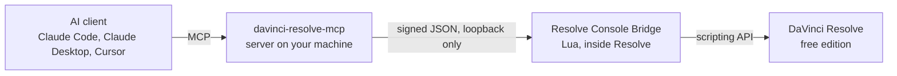

# Resolve Console Bridge

[](LICENSE)
[](https://github.com/ET-sec/resolve-console-bridge/actions/workflows/tests.yml)
[](https://github.com/ET-sec/resolve-console-bridge/actions/workflows/security.yml)

An MCP client can drive the free edition of DaVinci Resolve through this bridge.

Resolve 21.1 moved Python scripting to Studio, which cut the free edition off from
[davinci-resolve-mcp](https://github.com/samuelgursky/davinci-resolve-mcp). The Console under the
Workspace menu still runs Lua. This bridge runs there, inside Resolve, and answers the MCP server
over an authenticated loopback socket, so Claude Code, Claude Desktop or Cursor can reach the
scripting API on the free edition: projects, timelines, render presets, the render queue.

Built by [Emmanuel Tigoue](https://et-sec.github.io/portfolio/), who uses it every day to edit
and publish short-form video. It is short enough to read before you paste it into your editor.



| You want to | Go to |
|---|---|
| Install it and see it move Resolve | [What you need](#what-you-need), then [Install](#install) |
| Decide whether to run this inside your editor | [Is it safe](#is-it-safe) |
| Know what it cannot do before you plan around it | [What it cannot do](#what-it-cannot-do) |
| Read the protocol and the measurements | [docs/HOW_IT_WORKS.md](docs/HOW_IT_WORKS.md) |

## What you need

| Requirement | Notes |
|---|---|
| DaVinci Resolve 21.1 or later, free edition | Tested on 21.1.0.14. Studio owners do not need this: external scripting already works there. |
| macOS, Windows or Linux | Built and tested on macOS. The Windows and Linux paths are in the code and the installers, and the issue template asks which platform you are on. |
| [davinci-resolve-mcp](https://github.com/samuelgursky/davinci-resolve-mcp) v4.7.9 or later | The MCP server this bridge talks to. Its install guide covers the AI clients. |
| An AI client that speaks MCP | Claude Code, Claude Desktop, Cursor. |

Resolve is free and so is this bridge. What costs money is the AI client. If you already pay for
one of the clients above, this costs you nothing more. If you do not, you are weighing a
subscription against DaVinci Resolve Studio, a one-time purchase that turns external scripting on
and makes this bridge unnecessary. Some people will be better off buying Studio; check before you
install.

## Install

### macOS and Linux

```bash
git clone https://github.com/ET-sec/resolve-console-bridge.git
cd resolve-console-bridge
bash install.sh
```

You should see `install: bridge files copied to ...`, then `install: wrote a new config at ...`,
then a short `Done.` message with the one line to paste into Resolve. The installer copies the
bridge into a folder under your home directory, writes a config file with a token generated on
your machine, and prints that line. It does not ask for your password. Run it again later and it
says `install: keeping the existing config` and leaves your token alone.

### Windows

Download the repository as a ZIP from the green Code button (or `git clone` it), unzip it, open
PowerShell in that folder, then:

```powershell
powershell -ExecutionPolicy Bypass -File .\install.ps1
```

You get the same three messages and the same line, with `USERPROFILE` in place of `HOME`.

### The MCP server

Follow the [davinci-resolve-mcp install guide](https://github.com/samuelgursky/davinci-resolve-mcp/blob/main/docs/install.md)
for your AI client (`python install.py` from its checkout). Its free-edition section describes a
Python bridge for Resolve 21.0.x; skip that on 21.1, this bridge takes its place and reads the
same config file. Then add one variable to the server's entry in your client's MCP config, so the
server talks to this bridge and reports its own faults instead of falling back to external
scripting without saying so:

```json
{
  "mcpServers": {
    "davinci-resolve": {
      "command": "...",
      "args": ["..."],
      "env": {
        "DAVINCI_RESOLVE_BRIDGE": "1"
      }
    }
  }
}
```

Restart the client after saving.

### Start it

1. Open DaVinci Resolve and open a project.
2. Workspace > Console.
3. Paste the line the installer printed and press Enter.

```lua
dofile(os.getenv("HOME") .. "/.config/davinci-resolve-mcp/console-bridge/resolve_bridge.lua")
```

You should see `[resolve-bridge] bridge 1.0.0 listening on 127.0.0.1:...` in the Console.

4. In your AI client, ask: *What version of Resolve is open right now?* The answer should name
   the version you are running.

Paste the line again each time you open Resolve. The Console does not remember it, and the bridge
lives only as long as the Resolve session. Keep the line in a note.

## Is it safe

| Property | How it holds |
|---|---|
| Only your machine can reach it | The bridge listens on the loopback address and refuses to start if its config names any other address. |
| Every request is signed | The MCP client signs each request with a token that lives in one file only your account can read. The installer generates that token on your machine. It is not in this repository and it does not travel over the socket. |
| A request works once, for about a minute | Each request carries a timestamp and a one-use nonce, so a captured request cannot be replayed. |
| It has the same reach you have from the Console, no more | The bridge's own operation list is fixed and private attribute names are refused. One of those operations, `call`, hands the MCP server the whole Resolve scripting API, which is the point of the tool: the AI can create and delete projects, place clips and queue renders to any folder your account can write, the same as you at the keyboard. Put the limits on the client side, with the [guard](guard/README.md) and your client's tool allow list. |
| Nothing runs with elevated rights | The installer writes only under your home folder and never asks for your password. The bridge runs with your normal user rights inside Resolve. |

The protocol, every refusal code and the path policy are in [docs/HOW_IT_WORKS.md](docs/HOW_IT_WORKS.md).
Security reports go through [private vulnerability reporting](https://github.com/ET-sec/resolve-console-bridge/security/advisories/new);
see [SECURITY.md](SECURITY.md).

### What I found in the MCP server, and the guard

I read davinci-resolve-mcp 4.7.9 in full before running it against my own projects. There is no
malicious code in it. Three of its capabilities could still hurt you: it can run commands you never
wrote (project spec hooks), it can switch off its own confirmation gate (a setup call), and it can
delete a directory tree you point it at (an analysis cleanup call). The [guard](guard/README.md)
is a Claude Code hook that refuses all three. The installer copies it next to the bridge; wiring it
in takes one block in your settings file. If you use another client, its own tool allow list is the
place to refuse the same three calls.

### If Blackmagic closes the Console

Blackmagic can remove Console scripting in any release. If an update stops the `dofile` line from
running, I will note it at the top of this README.

## What it cannot do

- Color wheels, curves and most Inspector sliders are not exposed to scripting on any edition, so
  they are still done by hand.
- IntelliSearch, speech generation, AI analysis and Render in Place are licensed features. The
  bridge does not change what your license allows.
- A modal dialog in Resolve blocks the whole scripting API until you close it. If the AI client
  reports a timeout, look at Resolve first.
- The bridge does not outlive Resolve. Quit Resolve and it is gone; paste the line again next time.

## Troubleshooting

| You see | What it means | Do this |
|---|---|---|
| `config error: cannot read bridge config` in the Console | The installer has not been run under this user account, or the config was deleted | Run `bash install.sh` (or `install.ps1`) again |
| `cannot open ...resolve_bridge.lua` or `module 'bridge' not found` in the Console | The installed folder was moved or deleted | Run the installer again; it copies the files back into place |
| The AI client says the bridge is unreachable | One of the four checks below is missing | Go through the list below the table |
| `cannot bind 127.0.0.1` in the Console | Something else on your machine holds the port the installer picked | Delete `bridge.json` from the config folder and run the installer again; it picks a fresh random port and a fresh token |

When the client cannot reach the bridge, check in this order:

1. Resolve is open with a project open.
2. The Console line was pasted in this Resolve session, and the Console printed the listening line.
3. `DAVINCI_RESOLVE_BRIDGE` is set to `1` in the client's MCP config.
4. The client was restarted after that config change.

The bridge also writes `console-bridge.log` beside its config. It holds start and stop lines and a
request count. The token is not written to it.

## Tests

The protocol suite checks the hash and HMAC implementations against published vectors and replays
requests the real MCP client signed. The end-to-end suite starts the bridge under LuaJIT with a fake
Resolve object model and drives it with the real MCP client, including every refusal.

```bash
git clone --branch v4.7.9 --depth 1 https://github.com/samuelgursky/davinci-resolve-mcp.git upstream
luajit test/test_protocol.lua test/fixtures.json           # 49 checks
python3 test/e2e_client.py upstream                         # 39 checks
BRIDGE_CONSOLE_MODE=1 python3 test/e2e_client.py upstream   # the same 39, started the way the Console starts it
```

Continuous integration runs all three on Ubuntu and macOS on every pull request and every push to
main, then runs the installer on a fresh home directory and serves the suite from the installed copy. Secrets scanning, a
vulnerability scan and static analysis run alongside, and every action is pinned by commit.

## Support

This is maintained in the gaps around other work, so there is no support desk. Issues are welcome,
and the [issue template](https://github.com/ET-sec/resolve-console-bridge/issues/new/choose) asks
for the details that usually settle it. [CONTRIBUTING.md](CONTRIBUTING.md) explains how changes
land and why the commit history carries one identity.

## Credits

- [davinci-resolve-mcp](https://github.com/samuelgursky/davinci-resolve-mcp) by Samuel Gursky
  and contributors, MIT. This bridge implements its in-app bridge protocol for the Lua interpreter
  that free 21.1 still ships.
- [AutoSubs](https://github.com/tmoroney/auto-subs) by Tom Moroney, MIT, whose Lua-inside-Resolve
  design showed the free edition could be driven from within, and whose bundled copy of
  [ljsocket](lib/ljsocket.lua) (originally by CapsAdmin) this bridge uses.

## License

[MIT](LICENSE). Third-party notices are at the bottom of that file.
